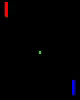

# tf-env

RL environments implemented in pure TensorFlow graphs.

# Pong environment

The pong environment is a proof of concept. It is a re-implementation of the Pong video game in TensorFlow.

## Trainability

The script [example/pong_ppo.py](example/pong_ppo.py) trains an agent on the Pong environment. On a decent GPU, it should take less than 10 minutes to get good at the game.

## Performance

The script [example/pong_bench.py](example/pong_bench.py) measures the FPS of the Pong environment. As an experiment, I ran the same benchmark for different batch sizes, and found that increasing the batch size on GPUs gives much more speedup than on CPUs. In fact, a Tesla K80 can easily run the environment 30x faster than a consumer-grade CPU.

Here are the benchmark results for a Tesla K80 GPU:

| # Environments | No Rendering | Rendering       |
|:--------------:|:------------:|:---------------:|
| 16             | 6087         | 3734            |
| 64             | 24512        | 12664           |
| 128            | 49239        | 20193           |
| 256            | 95893        | 30251           |
| 512            | 196626       | 49544           |
| 1024           | 371400       | 63665           |
| 2048           | 723868       | 74534           |

Here are the benchmark results on an old 2.6GHz Core i7. I was surprised to find that increasing the batch size eventually *hurts* performance.

| # Environments | No Rendering | Rendering       |
|:--------------:|:------------:|:---------------:|
| 16             | 22324        | 956             |
| 64             | 73182        | 925             |
| 128            | 130000       | 757             |
| 256            | 72752        | 693             |
